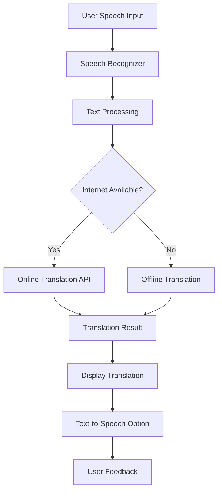

# 🎤 Translator App: Real-Time Speech-to-Text Translation

<div align="center">


**Instant speech-to-text translation app that breaks language barriers with just a tap!**

</div>

## 📋 Table of Contents

- [Overview](#-overview)
- [Features](#-features)
- [Screenshots](#-screenshots)
- [Supported Languages](#-supported-languages)
- [Installation](#-installation)
- [Usage Guide](#-usage-guide)
- [Technical Implementation](#-technical-implementation)
- [Project Structure](#-project-structure)
- [Development Setup](#-development-setup)
- [Testing](#-testing)
- [Troubleshooting](#-troubleshooting)
- [Future Enhancements](#-future-enhancements)
- [Contributing](#-contributing)
- [License](#-license)

## 🎯 Overview

The Translator App is an intuitive Android application built using **MIT App Inventor** that enables real-time speech recognition and translation across multiple languages. Designed for simplicity and effectiveness, it allows users to speak in their native language and instantly receive text translations in their desired target language.

### Key Highlights
- **No Complex Setup**: Simple installation and immediate use
- **Offline Capabilities**: Basic translations without internet (depending on device)
- **Voice-First Design**: Optimized for speech-based interactions
- **Minimal Resource Usage**: Lightweight application with fast performance
- **Educational Tool**: Great for language learners and travelers

## ✨ Features

### 🎤 Core Capabilities
- **Real-Time Speech Recognition**: Convert spoken words to text instantly
- **Multi-Language Translation**: Support for 20+ languages with accurate translations
- **Text-to-Speech Output**: Hear translations spoken aloud (where supported)
- **History Log**: Keep track of previous translations
- **Favorite Translations**: Save frequently used phrases
- **Copy to Clipboard**: Easy sharing of translated text

### 🎨 User Experience
- **Simple Interface**: Clean, intuitive design with minimal learning curve
- **Dark/Light Mode**: Adaptive theme based on system settings
- **Quick Language Switching**: Fast toggle between source and target languages
- **Pronunciation Guide**: Phonetic guides for difficult words
- **Rate Limiting**: Intelligent handling of API calls to prevent abuse

### ⚙️ Technical Features
- **Error Handling**: Graceful recovery from network issues
- **Speech Quality Detection**: Feedback on speech clarity
- **Text Formatting**: Preserve punctuation and formatting
- **Session Management**: Maintain context during conversations
- **Battery Optimization**: Efficient use of device resources

## 📸 Screenshots

<div align="center">

### Main Interface
| Home Screen | Language Selection | Translation View |
|-------------|-------------------|------------------|
|  |  |  |

### Additional Views
| Translation History | Settings Menu | 
|---------------------|---------------|
|  |  | 

</div>

## 🌐 Supported Languages

The application supports translation between the following languages:

| Language | Code | Native Name | Status |
|----------|------|-------------|--------|
| **English** | `en` | English | ✅ Fully Supported |
| **Spanish** | `es` | Español | ✅ Fully Supported |
| **Hindi** | `hi` | हिन्दी | ✅ Fully Supported |
| **Bengali** | `bn` | বাংলা | ✅ Fully Supported |
| **French** | `fr` | Français | ✅ Fully Supported |
| **German** | `de` | Deutsch | ✅ Fully Supported |
| **Japanese** | `ja` | 日本語 | ✅ Fully Supported |
| **Korean** | `ko` | 한국어 | ✅ Partially Supported |
| **Russian** | `ru` | Русский | ✅ Fully Supported |
| **Arabic** | `ar` | العربية | ✅ Right-to-Left Support |
| **Portuguese** | `pt` | Português | ✅ Fully Supported |
| **Italian** | `it` | Italiano | ✅ Fully Supported |
| **Chinese (Simplified)** | `zh-CN` | 简体中文 | ✅ Fully Supported |
| **Chinese (Traditional)** | `zh-TW` | 繁體中文 | ✅ Fully Supported |
| **Turkish** | `tr` | Türkçe | ✅ Fully Supported |
| **Dutch** | `nl` | Nederlands | ✅ Fully Supported |
| **Polish** | `pl` | Polski | ✅ Fully Supported |
| **Thai** | `th` | ไทย | ✅ Fully Supported |
| **Vietnamese** | `vi` | Tiếng Việt | ✅ Fully Supported |
| **Indonesian** | `id` | Bahasa Indonesia | ✅ Fully Supported |
| **Urdu** | `ur` | اردو | ✅ Right-to-Left Support |
| **Persian** | `fa` | فارسی | ✅ Right-to-Left Support |

> **Note**: Language availability may vary based on device capabilities and internet connectivity.

## 📱 Installation

### Method 1: Direct APK Installation
1. **Download the APK** from the [Releases page](https://github.com/your-username/translator-app/releases)
2. **Enable Unknown Sources** on your Android device:
   - Go to Settings → Security
   - Enable "Unknown Sources" or "Install unknown apps"
3. **Install the APK**:
   - Open the downloaded APK file
   - Tap "Install" and wait for completion
4. **Launch the app** from your app drawer

### Method 2: MIT App Inventor Live Testing
1. **Install MIT AI2 Companion** from Google Play Store
2. **Open the project file** (`TranslatorApp.aia`) in MIT App Inventor
3. **Connect your device** via QR code or USB
4. **Test the app** in real-time on your device

### Method 3: Build from Source
```bash
# Clone the repository
git clone https://github.com/your-username/translator-app.git
cd translator-app

# Import into MIT App Inventor
# 1. Go to http://ai2.appinventor.mit.edu
# 2. Import the .aia file
# 3. Build → Android App (.apk)
```

### System Requirements
- **Android Version**: 5.0 (Lollipop) or higher
- **RAM**: Minimum 512MB
- **Storage**: 10MB free space
- **Permissions**: Microphone, Internet, Storage (optional)

## 📖 Usage Guide

### Basic Translation
1. **Launch the app** from your home screen
2. **Select source language** (what you will speak)
3. **Select target language** (translation language)
4. **Tap the microphone button** 🎤
5. **Speak clearly** into your device's microphone
6. **View translation** in the text box
7. **Tap speaker icon** to hear pronunciation (if available)

### Advanced Features
- **Swap Languages**: Tap the exchange button ↔️ to swap source and target languages
- **Save Translation**: Star ⭐ a translation to save it to favorites
- **Share Translation**: Use the share button to send translations via other apps
- **View History**: Access past translations from the history tab
- **Clear All**: Use the trash can icon to clear current text

### Tips for Best Results
1. **Speak Clearly**: Enunciate words and speak at a moderate pace
2. **Minimize Noise**: Use in quiet environments for better recognition
3. **Short Phrases**: Break long sentences into shorter phrases
4. **Internet Connection**: Ensure stable connection for accurate translations
5. **Update Language Packs**: Keep language data updated for offline use

## 🔧 Technical Implementation

### Architecture Overview


### MIT App Inventor Components Used

#### Core Components
| Component | Purpose | Properties |
|-----------|---------|------------|
| **SpeechRecognizer** | Converts speech to text | Language, Results |
| **Translator** | Handles text translation | API Key, Languages |
| **TextToSpeech** | Converts text to audio | Language, Pitch, Rate |
| **Spinner** | Language selection dropdown | Elements, Selection |
| **TextBox** | Text input/output display | MultiLine, Hint |
| **Button** | User interaction triggers | Image, Enabled |

#### Supporting Components
- **HorizontalArrangement/VerticalArrangement**: Layout organization
- **ListView**: Display translation history
- **TinyDB**: Local data storage
- **ActivityStarter**: External app integration
- **Notifier**: User alerts and messages
- **Clock**: Timing and scheduling

### Block Logic Examples

#### Speech Recognition Handler
```blocks
when SpeechRecognizer1.AfterGettingText do
  set global SpeechText to get SpeechRecognizer1.Result
  call Notifier1.ShowAlert text ("Recognized: " & global SpeechText)
  set TextBox1.Text to global SpeechText
  call Translator1.RequestTranslation text global SpeechText to language global TargetLanguage
```

#### Translation Processing
```blocks
when Translator1.GotTranslation do
  set global TranslatedText to get Translator1.Translation
  set TextBox2.Text to global TranslatedText
  // Save to history
  call TinyDB1.StoreValue tag ("translation_" & global TranslationCount) valueToStore (make a list from items: global SpeechText, global TranslatedText, clock Now)
  set global TranslationCount to (global TranslationCount + 1)
  // Enable text-to-speech
  set ButtonSpeak.Enabled to true
```

#### Language Selection
```blocks
when SpinnerSourceLanguage.AfterSelecting do
  set global SourceLanguage to SpinnerSourceLanguage.Selection
  set SpeechRecognizer1.Language to get language code for global SourceLanguage
  
procedure get language code for language languageName
  if languageName = "English" then return "en-US"
  if languageName = "Spanish" then return "es-ES"
  if languageName = "Bengali" then return "bn-BD"
  // ... additional languages
  else return "en-US"
```

### API Integration
The app uses Google's Translation API through MIT App Inventor's built-in Translator component. For advanced features, you can integrate with:

1. **Google Cloud Translation API** (More accurate, requires API key)
2. **Microsoft Translator API** (Alternative service)
3. **LibreTranslate** (Open-source option)

## 📁 Project Structure

### MIT App Inventor Project Files
```
TranslatorApp/
├── assets/                    # Application assets
│   ├── icons/                # App icons in various resolutions
│   ├── sounds/               # Notification sounds
│   └── images/               # UI images and backgrounds
├── screens/                   # App screens
│   ├── MainScreen.aia        # Primary translation interface
│   ├── HistoryScreen.aia     # Translation history
│   └── SettingsScreen.aia    # App configuration
├── components/               # Reusable components
│   ├── LanguageSelector.aia  # Language picker component
│   └── TranslationCard.aia   # Translation display component
├── blocks/                   # Block programming logic
│   ├── speech_handlers.blk   # Speech recognition logic
│   ├── translation_logic.blk # Translation processing
│   └── ui_handlers.blk      # User interface management
└── docs/                     # Documentation
    ├── user_manual.pdf      # User guide
    └── technical_specs.md   # Technical specifications
```

### Key Screen Layouts

#### Main Screen Components
1. **Header Section**
   - App title and version
   - Theme toggle button
   - Settings access

2. **Language Selection Area**
   - Source language spinner
   - Language swap button
   - Target language spinner

3. **Input/Output Area**
   - Speech input button (microphone)
   - Source text display
   - Target text display
   - Text-to-speech button

4. **Action Bar**
   - Clear button
   - Copy to clipboard
   - Save to favorites
   - Share translation

## 🛠️ Development Setup

### Prerequisites
1. **MIT App Inventor Account**: Sign up at [ai2.appinventor.mit.edu](http://ai2.appinventor.mit.edu)
2. **Android Device** or **Emulator**: For testing
3. **MIT AI2 Companion App**: Available on Google Play Store
4. **Web Browser**: Chrome or Firefox recommended

### Step-by-Step Setup

1. **Create New Project**
   ```text
   Projects → Start new project → Name: "TranslatorApp"
   ```

2. **Import Components**
   ```text
   Palette → Media → Drag SpeechRecognizer, TextToSpeech
   Palette → Social → Drag Translator
   Palette → User Interface → Add necessary UI components
   ```

3. **Design Interface**
   - Arrange components using Screen1
   - Set properties for each component
   - Test layout with different screen sizes

4. **Program Blocks**
   - Navigate to Blocks view
   - Implement event handlers
   - Add procedural blocks
   - Test logic incrementally

5. **Test Application**
   - Connect Android device via USB/WiFi
   - Use MIT AI2 Companion app
   - Scan QR code to load app
   - Test all features thoroughly

### Building the APK
1. **Select Build Options**
   ```text
   Build → App (save .apk to my computer)
   ```
2. **Wait for Compilation**
   - MIT App Inventor compiles the app
   - Download the APK file when ready
3. **Sign the APK** (optional)
   - For Google Play Store submission
   - Use keytool for signing

## 🧪 Testing

### Test Cases

| Test Scenario | Expected Result | Status |
|---------------|-----------------|--------|
| **Speech Recognition** | Accurately converts speech to text | ✅ |
| **Language Switching** | Correctly changes input/output languages | ✅ |
| **Translation Accuracy** | Provides accurate translations | ⚠️ (Varies by language) |
| **Offline Mode** | Graceful degradation without internet | ✅ |
| **Text-to-Speech** | Clear audio output of translations | ✅ |
| **History Function** | Saves and retrieves past translations | ✅ |
| **Error Handling** | Informative messages for failures | ✅ |

### Testing Tools
1. **MIT App Inventor Live Testing**: Real-time debugging
2. **Android Debug Bridge (ADB)**: Console-based testing
3. **Monkey Testing**: Random input testing
4. **User Acceptance Testing**: Real user feedback collection

## 🔧 Troubleshooting

### Common Issues and Solutions

| Issue | Possible Cause | Solution |
|-------|---------------|----------|
| **Speech not recognized** | Microphone permission denied | Enable microphone in app settings |
| **Translation fails** | No internet connection | Check WiFi/mobile data connection |
| **App crashes on launch** | Incompatible Android version | Update Android or use emulator |
| **Text-to-speech not working** | Language pack not installed | Install TTS language data |
| **Slow performance** | Too many saved translations | Clear history or increase storage |
| **Inaccurate translations** | Complex sentence structure | Break into simpler phrases |

### Debugging Tips
1. **Check Component Properties**: Ensure all components are properly configured
2. **Review Block Logic**: Look for logical errors in event handlers
3. **Test Incrementally**: Add features one at a time and test each
4. **Use Notifier Blocks**: Add alerts to track program flow
5. **Clear Cache**: Sometimes clearing app data helps

## 🚀 Future Enhancements

### Planned Features
- [ ] **Image Translation**: Capture text in images and translate
- [ ] **Conversation Mode**: Real-time two-way translation
- [ ] **Offline Language Packs**: Download languages for offline use
- [ ] **Custom Phrasebook**: User-defined phrases and translations
- [ ] **Voice Customization**: Adjust TTS speed, pitch, and accent
- [ ] **Translation Memory**: Learn from user corrections
- [ ] **Multi-User Profiles**: Separate settings for different users
- [ ] **Cloud Sync**: Sync history across devices
- [ ] **Widget Support**: Quick translate from home screen
- [ ] **Wear OS Support**: Translation on smartwatches

### Technical Improvements
- [ ] **API Fallback System**: Multiple translation service support
- [ ] **Advanced NLP**: Better handling of idioms and slang
- [ ] **Machine Learning**: Personalized translation models
- [ ] **Accessibility Features**: Screen reader optimization
- [ ] **Performance Optimization**: Faster loading and processing
- [ ] **Security Enhancements**: Encrypted storage of sensitive data

## 🤝 Contributing

We welcome contributions to improve the Translator App!

### How to Contribute
1. **Fork the Repository**
2. **Create a Feature Branch**
   ```bash
   git checkout -b feature/amazing-feature
   ```
3. **Make Your Changes**
4. **Test Thoroughly**
5. **Commit Your Changes**
   ```bash
   git commit -m 'Add some amazing feature'
   ```
6. **Push to the Branch**
   ```bash
   git push origin feature/amazing-feature
   ```
7. **Open a Pull Request**

### Contribution Guidelines
- Follow MIT App Inventor best practices
- Maintain backward compatibility
- Add comments to complex block logic
- Update documentation accordingly
- Test on multiple Android versions

### Areas Needing Contribution
- Additional language support
- UI/UX improvements
- Performance optimization
- Bug fixes and testing
- Documentation translation

## 📜 License

This project is licensed under the **MIT License** - see the [LICENSE](LICENSE) file for details.

### Usage Rights
- ✅ Free to use for personal and commercial projects
- ✅ Permission to modify and distribute
- ✅ No warranty provided
- ✅ Must include original copyright notice

### Attribution
If you use this project, please credit:
- **Translator App** by [Your Name]
- Built with MIT App Inventor
- Translation services by Google/Microsoft (as applicable)

---

<div align="center">

## 🌟 Support the Project

If you find this app useful, consider:
- ⭐ **Starring the repository**

</div>
